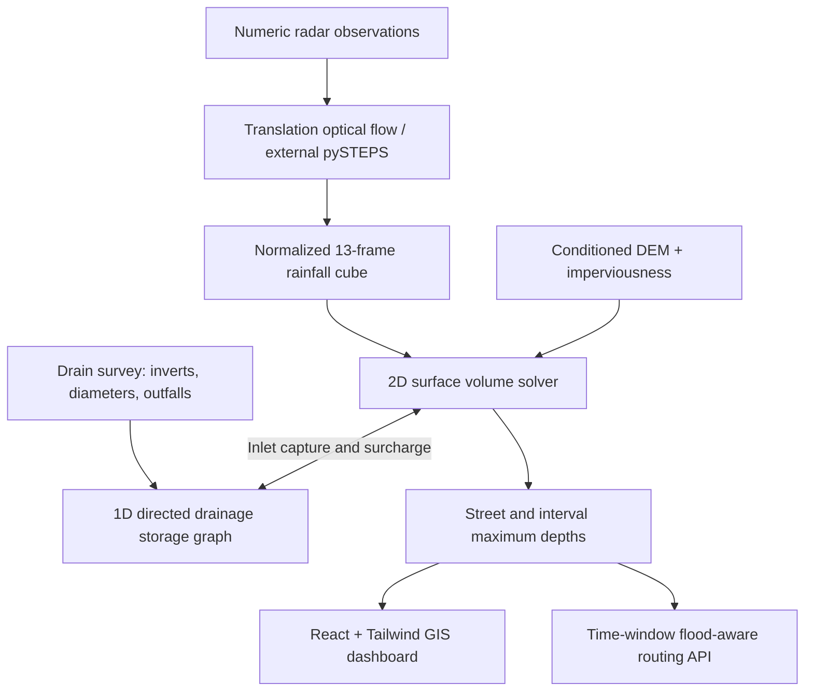

# Varsha — Urban Flood Intelligence

A complete, runnable research prototype for 0–3 hour coupled urban flood nowcasting. Built with React 19, Tailwind CSS 4, TypeScript, Vinext and a Cloudflare-compatible API. Python is not required.

## Start locally

Use Node.js 22.13+ (Node 24 recommended) and npm.

```sh
npm ci
npm run dev
```

Open the local URL printed by the server, normally http://localhost:3000.

```sh
npm test          # numerical, input-validation and routing tests
npm run typecheck
npm run build    # deployable Worker and browser assets
npm start        # serve the production Worker locally with Wrangler
```

## What works

- Mumbai, Delhi and Chennai demonstration catchments, 13 forecast frames from 0 to 180 minutes, and adjustable rainfall, drainage blockage and tailwater.
- Georeferenced, pannable, zoomable SVG GIS showing every modeled road segment. Select streets, switch terrain/flood layers, show drain direction and surcharge, animate time, and export a GeoJSON forecast.
- Rainfall advection API: global translation optical-flow estimation from three observed grids, followed by bilinear semi-Lagrangian advection.
- Coupled 2D local-inertial surface flow and 1D head-driven drainage storage graph; Horton infiltration, Manning pipe conveyance, bidirectional inlet exchange, outfalls and backflow.
- Conservative water-volume accounting, interval maximum flood depths, and a 3-hour water-balance audit in the dashboard.
- Flood-aware route comparisons for commuter, transit and emergency profiles. Flooded and closed edges are excluded. Routes use interval peaks over the next 30 minutes and return `no_route` or `insufficient_data` when appropriate.
- Validated JSON imports for surveyed terrain/drains/roads and normalized radar or pySTEPS forecasts. Null rainfall is rejected as missing coverage.
- Optional operator-configured live HTTPS feed with 60-second dashboard refresh and stale-observation checks.
- JSON API, GeoJSON route response, OpenAPI 3.1 specification, and responsive keyboard-accessible UI.

## Important scope

This is a working computational prototype, **not an operational or calibrated flood warning system**. The default terrain, drainage and street geometry are synthetic. City place names are illustrative context. The 100 m demo grid and its depths must not be interpreted as surveyed street accuracy.

The pipe solver is a reduced-order head-driven storage network, **not** a complete Saint-Venant dynamic-wave implementation. No ML surrogate is trained. The advection implementation estimates a single translation, not the full pySTEPS stochastic STEPS model. Real numeric IMD DWR access, city drain surveys and observed flood calibration are not bundled. All three demos share a synthetic catchment design anchored at different city coordinates.

Depth thresholds are unvalidated example policies, not safe-water driving limits. Road direction and closures are supported, but real traffic, bridge-deck heights, OSM turn restrictions and live municipal closures are not available in the demo. The map intentionally identifies synthetic geometry rather than placing invented streets over a real basemap.

## Live input

Copy `.env.example` to `.env.local`, set `FLOOD_INPUT_URL` to an authorized HTTPS endpoint returning the JSON in [docs/DATA_CONTRACT.md](docs/DATA_CONTRACT.md), and optionally set `FLOOD_INPUT_TOKEN`. Restart the development server. Select **Data & model → Load configured live feed**. An unconfigured feed returns HTTP 503; stale or incomplete data returns 422. No fallback silently substitutes synthetic rainfall for live inputs.

The feed adapter does not fetch arbitrary browser-supplied URLs, follow redirects, or expose its bearer token. Refreshes revalidate the source timestamp. Live observations must be no older than 20 minutes. Set secrets in the hosting environment for deployment; never commit them.

## API

| Endpoint                                                                  | Purpose                                                 |
| ------------------------------------------------------------------------- | ------------------------------------------------------- |
| `GET /api/health`                                                         | Model version and adapter status                        |
| `GET /api/forecast?city=mumbai&rainfallMmHr=80&blockage=0.3&tailwaterM=0` | Synthetic coupled forecast and dataset                  |
| `POST /api/nowcast`                                                       | Three rain observations → 13 advected rain frames       |
| `POST /api/simulate`                                                      | Custom normalized dataset/rainfall → coupled forecast   |
| `POST /api/route`                                                         | Baseline and lower-exposure route with GeoJSON geometry |
| `GET /api/live`                                                           | Configured, validated live input → forecast             |
| `GET /api/openapi`                                                        | Machine-readable API specification                      |

Routing request:

```json
{
  "scenario": {
    "city": "mumbai",
    "rainfallMmHr": 80,
    "blockage": 0.3,
    "tailwaterM": 0
  },
  "from": "n0",
  "to": "n48",
  "departureMinute": 60,
  "mode": "commuter"
}
```

`from` and `to` accept modeled junction IDs or `[longitude, latitude]` within 250 m of a junction. The response includes `status`, `safer`, `baseline`, `excludedEdges`, `thresholdCm`, `validUntil`, and a GeoJSON `geometry`. Only `status: "ok"` contains a proposed route. Baseline is for comparison and is not a fallback. Demo API CORS is enabled for navigation integration; private hosted access may still require authentication.

## Architecture



See [docs/MODEL.md](docs/MODEL.md) for equations and numerical assumptions, [docs/DATA_CONTRACT.md](docs/DATA_CONTRACT.md) for input format, and [docs/PRODUCTION.md](docs/PRODUCTION.md) for real-data integration and deployment.

## Project layout

- `app/` — dashboard route, metadata, styles and HTTP API handlers.
- `components/` — dashboard, GIS map, data/drainage/routing views and existing UI primitives.
- `lib/flood/` — typed datasets, synthetic fixtures, coupled solver, rainfall advection, validation, routing and live-feed adapter.
- `tests/` — physically meaningful invariants, analytical cases and routing failure cases.
- `docs/` — model, data schema, sources and deployment notes.

The project has no database requirement; demo forecasts are cached in memory for five minutes with an eight-entry bound. Imported forecasts are held in the current browser session and are not persisted. Two optional WebMCP tools expose the loaded summary and selected timeline; they are feature-detected and do not affect unsupported browsers.
